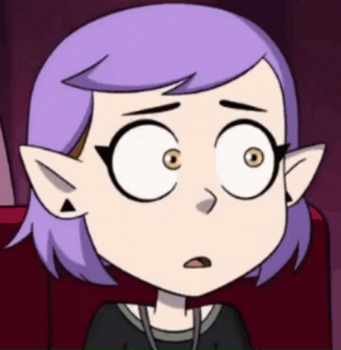
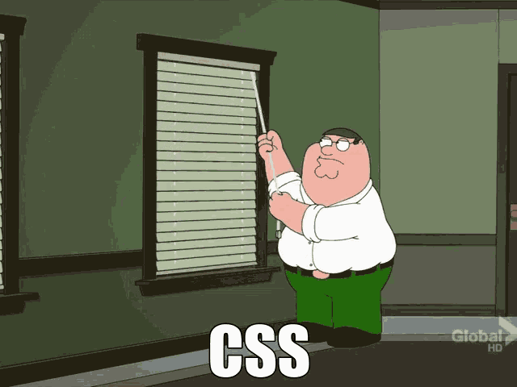

# Hey guys, Am here!

I'm ``Amity`` (my alias) and in short-form, ``Am``. 
I'm studying in the digital track of my *totally prestigious secondary school*. Currently in my second year.

## The things about me 

I'm just your average burnt-out gifted kid from your secondary school.
That guy who gets stressed for making **Scratch** games.

I'm currently learning about web development, mainly HTML, CSS, PHP and others, but I might start learning on another programming language and make a game out of it, I guess. ``¯\_(ツ)_/¯``  
And yes, I can't live without Stack Overflow. /lh

Fav character's Amity Blight, hence mah name!

##

##

